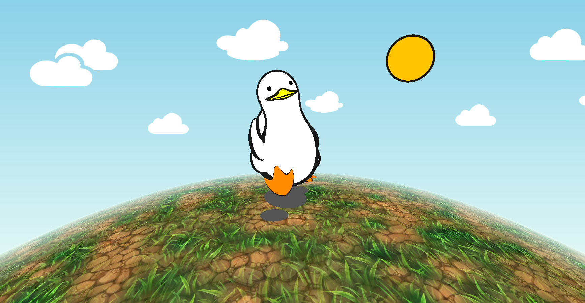

# CIS 566 Project 3: Case Study

* Univer sity of Pennsylvania - CIS 566 Project 3: Case Study
* pennkey : byumjin
* name : [Byumjin Kim](https://github.com/byumjin)

## Live Demo

* [Live Demo Link](https://byumjin.github.io/SadDuck/)
* [Shader Toy](https://www.shadertoy.com/view/4sdcz8)

To compare this with the reference without extra credit features, please turn "PureDuck" option on.  

## Overview

Using SDF(Signed Distance Function)s and toon shading, I have created the Duck refered to the reference image above. 

## Comparision

| SDF Duck | Reference |
| --- | --- |
|  |  |

### Used Techniques

- Modelling the duck

  It is nearly same what I did for my previous [HW](https://byumjin.github.io/procedural_kirby/).
  The all parts of my duck are created by unioning of spheres and ellipsoids (some of them are bended, streched, scaled).
  Making hierarchy structure was good for controlling duck's animations like below.
  
 | Hierarchy |
 | --- | 
 |  |

- Head Bob

  I used simple sin function to bob the head.
  And there is a little time gap between head bobbing and Body bobbing to make it more natural.

- Tail Wag

  It seemed that just using one geometry to make tail wag looked difficult.
  So, I add tail, which is an ellipsoid, then used smoothUnion function to make them merge smoothly.
  Then, wagged the tail with the opposite direction from those of its body.

- Match the movement of the feet

  Gaited motion is the most common and also tricky animation.
  This is because if we just use simple functions like sin or cos for makking the legs swing, it won't look natural.
  To fix this, I assgined more timeline for landing motion. 

- Shading of the duck

  Making shading model to immitate reference image was interesting because it was literally toon shading.
  Coloring was simple but adding edges was tricky because it was impossible to assign the edges what I intended (accurate width, accurate position) with just using raymarching.
  Anyway, to make these effect, I used Dot product of normal and view direction. If this value is less than a certain threshold value, it is area of the edge.
  And, I also used AO information to complement this.

- Fake shadows as circles

  There are two options to do this. First one is, make this as screen space effect with using UV coordinates of our scene.
  The other one is, add other implicit surfaces like the duck and make them look like flat shadow tracing the duck's feet.
  First option was more efficient and easy but I didn't want to make my scene fixed for just one view direction.
  So, I added 3 flat ellipsoids under the duck's feet. And made them move the same way.

### For More...

I added Day of Time system.

- Sun and Moon
- Sky gradation
- Sky objects such as clouds and star fields
- Land which uses blended textures along noise
- Fog

## Reference

- [Íñigo Quílez's web site](http://www.iquilezles.org/index.html)